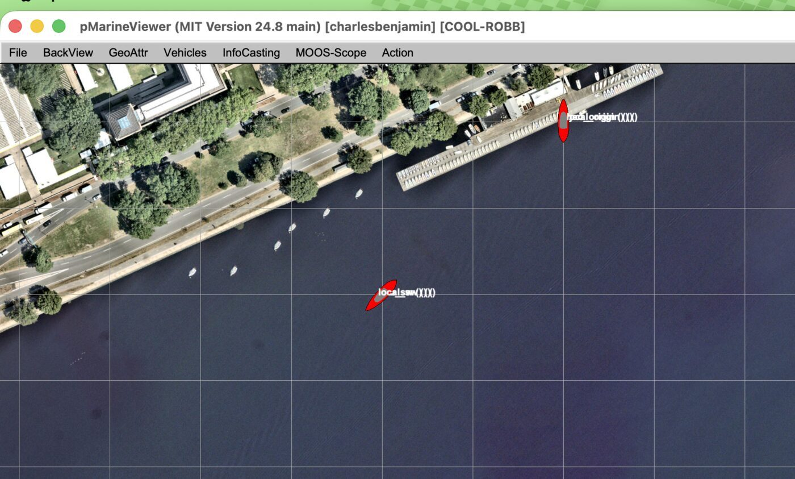
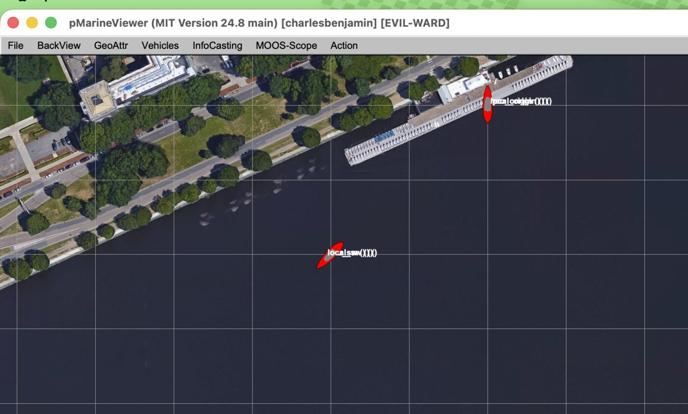

# MIT pMarineViewer validation

Validated on July 13, 2026 against MOOS-IvP 24.8 `main` and its shipped
`MIT_SP.tif` background.

## Test

MOOS Map generated an Esri World Imagery replacement using the exact shipped
MIT bounds and datum:

```text
Bounds: W -71.094214, S 42.354150, E -71.080058, N 42.360264
Origin: 42.358436, -71.087448
Zoom: 19
TIFF: 5278 x 3085 px, 44,819,020 bytes
```

The generated bundle passed `moos-map verify`. The same minimal pMarineViewer
mission was then launched once with the shipped TIFF and once with the generated
TIFF. Three pairs of stationary vehicles were posted at local coordinates
`(0,0)`, `(180,120)`, and `(-100,-100)`. Each pair contained:

- one `NODE_REPORT` using local `X,Y`;
- one `NODE_REPORT` using the corresponding `LAT,LON` calculated and checked
  with the checkout's `CMOOSGeodesy` implementation.

The local and geographic vehicle in every pair rendered in the same position.
After adjusting only pMarineViewer's pixel-dependent display zoom for the
different TIFF dimensions, the vehicle positions, dock, shoreline, roads, and
grid also occupied the same screen positions on both backgrounds.

## Screenshots

Generated MOOS Map background:



Shipped MOOS-IvP background:



The imagery is from different dates, so boats, trees, shadows, and colors vary.
The fixed shoreline, dock, road, and building geometry align.

## Conclusion

The exact crop, `.info` bounds, datum, TIFF loading, and local-versus-geographic
vehicle placement behave equivalently to the shipped MIT map. This is enough to
accept the current generator workflow for v1.0.

It is not a surveyed ground-control test and does not prove the theoretical
UTM/affine error estimate at every map size or latitude. Additional real mission
tracks and surveyed landmarks remain deferred in [TODO.md](../TODO.md).
